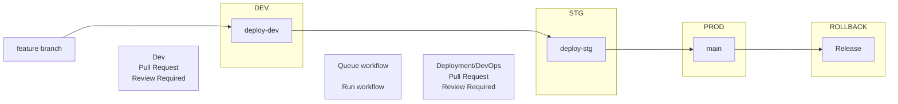

```mermaid
flowchart LR
    A[feature branch] ----> B
    A ~~~ C["Dev\nPull Request\nReview Required"]
    C ~~~ B
    subgraph DEV
        B[deploy-dev]
    end
     C ~~~ G["Queue workflow
        \nRun workflow"]

    B ----> D
    G ~~~ H["Deployment/DevOps\nPull Request\nReview Required"]
    H ~~~ D

    subgraph STG
        D[deploy-stg]
    end
    D ----> E
    subgraph PROD
        E[main]
    end
    E ----> F
    subgraph ROLLBACK
        F[Release]
    end


```
 

    
